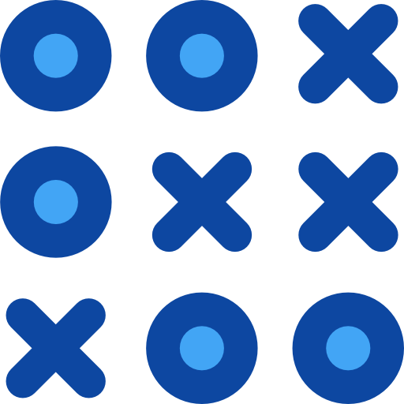

![Contributor][contributors-shield]

<h1 align="center"> Tic Tac Toe </h1>
 

 

Image Credits: 
<a href="https://www.flaticon.com/free-icons/tic-tac-toe" target="_blank">
Vitaly Gorbachev
</a>

 
Tic-tac-toe is played on a three-by-three grid by two players, who alternately place the marks X and O in one of the nine spaces in the grid.
 
 

  
Table of Contents

  <ol>
    <li>
      <a href="#about-the-project">About The Project</a>
      <ul>
        <li><a href="#built-with">Built With</a></li>
      </ul>
    </li>
    <li>
      <a href="#getting-started">Getting Started</a>
      <ul>
        <li><a href="#prerequisites">Prerequisites</a></li>
        <li><a href="#installation">Installation</a></li>
      </ul>
    </li>
    <li><a href="#usage">Usage</a></li>
    <li><a href="#roadmap">Roadmap</a></li>
    <li><a href="#contributing">Contributing</a></li>
    <li><a href="#license">License</a></li>
    <li><a href="#contact">Contact</a></li>
    <li><a href="#acknowledgments">Acknowledgments</a></li>
  </ol>

## About The Project

![Player 1 starts][p1-starts]

[contributors-shield]: <https://img.shields.io/github/contributors/mangalakader/tic-tac-toe-quiqup?style=for-the-badge>
[p1-starts]: <./docs/images/p1_starts.png> "Player 1 starts the game"
