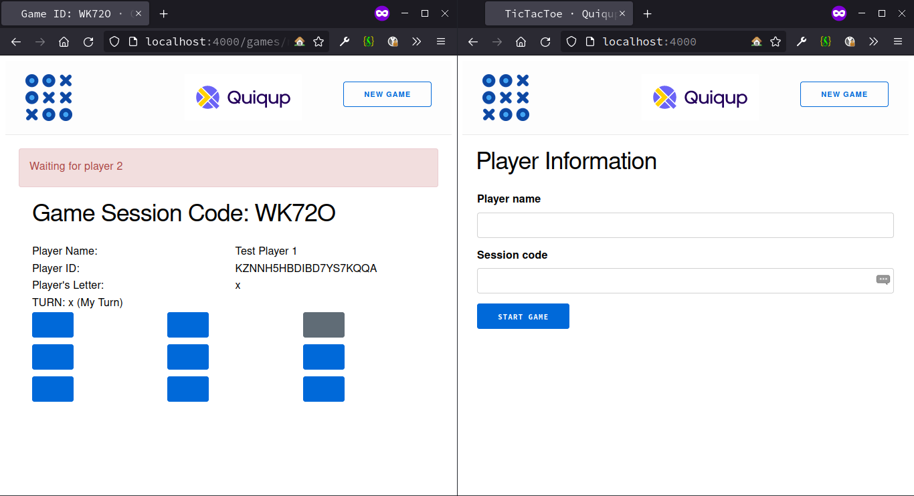

![Contributor][contributors-shield]

<h1 align="center"> Tic Tac Toe </h1>
 

 

Image Credits: 
<a href="https://www.flaticon.com/free-icons/tic-tac-toe" target="_blank">
Vitaly Gorbachev
</a>

 
 

  
Table of Contents

  <ol>
    <li>
      <a href="#about-the-project">About The Project</a>
      <ul>
        <li><a href="#built-with">Built With</a></li>
      </ul>
    </li>
    <li>
      <a href="#getting-started">Getting Started</a>
      <ul>
        <li><a href="#prerequisites">Prerequisites</a></li>
        <li><a href="#installation">Installation</a></li>
        <li><a href="#screenshots">Screenshots</a></li>
      </ul>
    </li>
    <li><a href="#contributing">Contributing</a></li>
  </ol>

## About The Project

![Player 1 starts][p1-starts]

Tic-tac-toe is played on a three-by-three grid by two players, who alternately place the marks X and O in one of the nine spaces in the grid.

The basic user stories for the minimal version of the project are:

* As an API user I should be able to create a new tic tac toe game session
* As an API user I should be able to complete a turn as the crosses (X) player
* As an API user I should be able to complete a turn as the naughts (O) player
* As an API user when I make a winning move, I should be informed and the game should be completed with a win status

Additionally, the following features need to be provided:

* Allow two players to have some kind of session such that they could both use the API as separate actors and compete with each other
* Build a frontend for your game, anyway you like, and have the full stack operational

### Built With

* [Elixir](https://elixir-lang.org/)
* [Phoenix Framework](https://www.phoenixframework.org/)
* [Phoenix LiveView](https://hexdocs.pm/phoenix_live_view/installation.html)

## Getting Started

### Prerequisites

* Erlang - [Install Erlang](https://github.com/erlang/otp#installation)
* Elixir - [Install Elixir](https://elixir-lang.org/install.html)

### Installation

To get started locally:

* Download the dependencies using `mix deps.get`
* To start the interactive development server `iex -S mix phx.server`

Now open your browser and visit `http://localhost:4000` and you should see a player information page, type out the form and click `Join Game`.

Now open another window or a tab and visit the same url to join as another player.

### Screenshots

[contributors-shield]: <https://img.shields.io/github/contributors/mangalakader/tic-tac-toe-quiqup?style=for-the-badge>
[p1-starts]: <./docs/images/p1_starts.png> "Player 1 starts the game"
