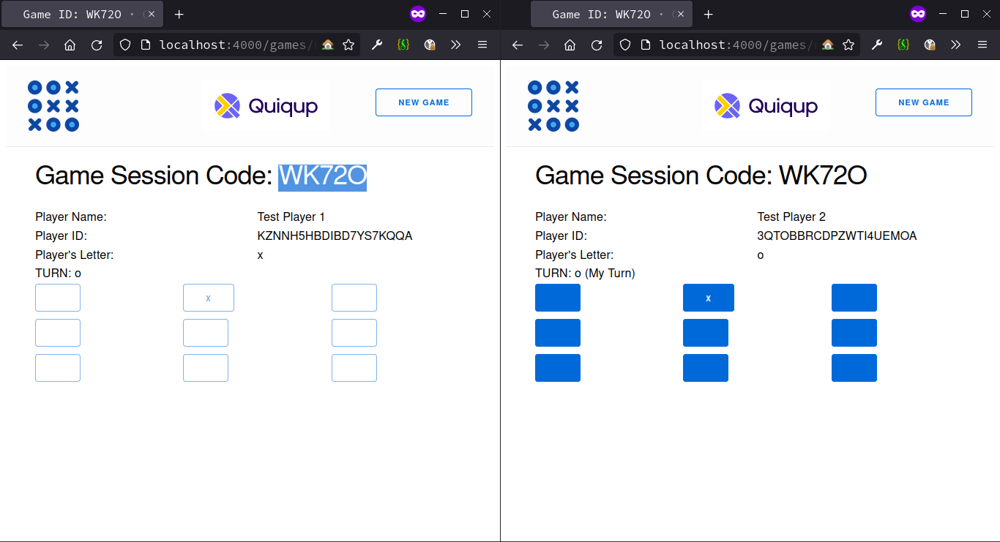
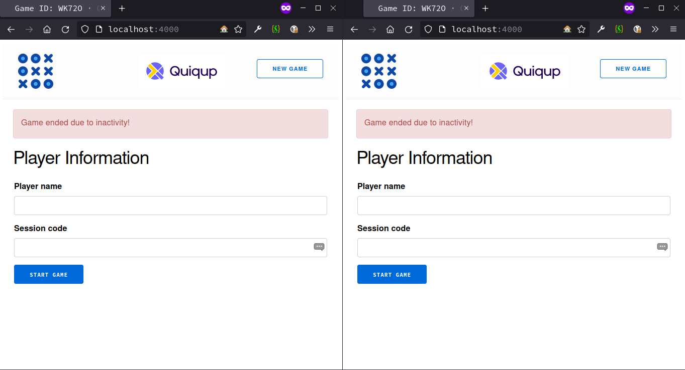

![Contributor][contributors-shield]

<h1 align="center"> Tic Tac Toe </h1>
<br />
<div align="center">

</div>
<br />
<div align="center">Image Credits: 
<a href="https://www.flaticon.com/free-icons/tic-tac-toe" target="_blank">
Vitaly Gorbachev
</a>
</div>
<br />
<br />
<details open>
  <summary>Table of Contents</summary>
  <ol>
    <li>
      <a href="#about-the-project">About The Project</a>
      <ul>
        <li><a href="#built-with">Built With</a></li>
      </ul>
    </li>
    <li>
      <a href="#getting-started">Getting Started</a>
      <ul>
        <li><a href="#prerequisites">Prerequisites</a></li>
        <li><a href="#installation">Installation</a></li>
        <li><a href="#screenshots">Screenshots</a></li>
        <li><a href="#api-usage">Api Usage</a></li>
      </ul>
    </li>
    <li>
    <a href="#contributing">Contributing</a>
      <ul>
        <li><a href="#Architecture">Architecture</a></li>
        <li><a href="#Conventions">Conventions</a></li>
        <li><a href="#Testing">Testing</a></li>
      </ul>
    </li>
  </ol>
</details>

## About The Project

![Player 1 starts][p1-starts]

Tic-tac-toe is played on a three-by-three grid by two players, who alternately place the marks X and O in one of the nine spaces in the grid.

The basic user stories for the minimal version of the project are:

* As an API user I should be able to create a new tic tac toe game session
* As an API user I should be able to complete a turn as the crosses (X) player
* As an API user I should be able to complete a turn as the naughts (O) player
* As an API user when I make a winning move, I should be informed and the game should be completed with a win status

Additionally, the following features need to be provided:

* Allow two players to have some kind of session such that they could both use the API as separate actors and compete with each other
* Build a frontend for your game, anyway you like, and have the full stack operational

### Built With

* [Elixir](https://elixir-lang.org/)
* [Phoenix Framework](https://www.phoenixframework.org/)
* [Phoenix LiveView](https://hexdocs.pm/phoenix_live_view/installation.html)

## Getting Started

### Prerequisites

* Erlang - [Install Erlang](https://github.com/erlang/otp#installation)
* Elixir - [Install Elixir](https://elixir-lang.org/install.html)

### Installation

To get started locally:

* Download the dependencies using `mix deps.get`
* To start the interactive development server `iex -S mix phx.server`

Now open your browser and visit `http://localhost:4000` and you should see a player information page, type out the form and click `Join Game`.

Now open another window or a tab and visit the same url to join as another player.

### Screenshots

</img>
</img>
</img>
</img>
</img>
</img>
</img>
</img>
</img>
</img>

### Api Usage

#### Create a New Game or Join a Game

For either creating a new game or joining an existing game, the request is the same.
* If you don't provide a session code, automatically a new game will be created with auto-generated session code
* If you provide a session code
     - if it exists, then you will be joining the game,
     - if it doesn't exists, then a new game will be created with the provided session code

##### Request

```bash
curl -X POST "http://localhost:4000/api/games" -H "Content-type: application/json" --data '{"player_name": "Test Player 1", "session_code": ""}'
```
##### Response Code - Success

```bash
201
```
##### Response Body - Success

```json
{
  "data": {
    "board": [
      {
        "col": 1,
        "row": 1,
        "value": null
      },
      {
        "col": 1,
        "row": 2,
        "value": null
      },
      {
        "col": 1,
        "row": 3,
        "value": null
      },
      {
        "col": 2,
        "row": 1,
        "value": null
      },
      {
        "col": 2,
        "row": 2,
        "value": null
      },
      {
        "col": 2,
        "row": 3,
        "value": null
      },
      {
        "col": 3,
        "row": 1,
        "value": null
      },
      {
        "col": 3,
        "row": 2,
        "value": null
      },
      {
        "col": 3,
        "row": 3,
        "value": null
      }
    ],
    "player_turn": "x",
    "players": [
      {
        "id": "CTPEXO7ES4XQEWNPXF5Q",
        "letter": "x",
        "name": "Test Player 1"
      },
      {
        "id": "ATPEXOERTXDFWNPXGHY",
        "letter": "o",
        "name": "Test Player 2"
      }
    ],
    "session_code": "AF33I",
    "status": "playing",
    "winner": null
  }
}
```

#### Capturing a Square in the Game or Updating the Game Board

##### Request

```bash
curl -X PUT "http://localhost:4000/api/games/AF33I" -H "Content-type: application/json" --data '{"player_id": "CTPEXO7ES4XQEWNPXF5Q", "row": 1, "col": 2}'
```
##### Response Code

```bash
200
```
##### Response Body - Success

```json
{
  "data": {
    "board": [
      {
        "col": 1,
        "row": 1,
        "value": "x"
      },
      {
        "col": 1,
        "row": 2,
        "value": null
      },
      {
        "col": 1,
        "row": 3,
        "value": null
      },
      {
        "col": 2,
        "row": 1,
        "value": null
      },
      {
        "col": 2,
        "row": 2,
        "value": null
      },
      {
        "col": 2,
        "row": 3,
        "value": null
      },
      {
        "col": 3,
        "row": 1,
        "value": null
      },
      {
        "col": 3,
        "row": 2,
        "value": null
      },
      {
        "col": 3,
        "row": 3,
        "value": null
      }
    ],
    "player_turn": "o",
    "players": [
      {
        "id": "CTPEXO7ES4XQEWNPXF5Q",
        "letter": "x",
        "name": "Test Player 1"
      },
      {
        "id": "ATPEXOERTXDFWNPXGHY",
        "letter": "o",
        "name": "Test Player 2"
      }
    ],
    "session_code": "AF33I",
    "status": "playing",
    "winner": null
  }
}
```

#### Getting the game board or Current state of the game

##### Request

```bash
curl -X GET "http://localhost:4000/api/games/AF33I"
```
##### Response Code

```bash
200
```
##### Response Body - Success

```json
{
  "data": {
    "board": [
      {
        "col": 1,
        "row": 1,
        "value": "x"
      },
      {
        "col": 1,
        "row": 2,
        "value": null
      },
      {
        "col": 1,
        "row": 3,
        "value": null
      },
      {
        "col": 2,
        "row": 1,
        "value": null
      },
      {
        "col": 2,
        "row": 2,
        "value": null
      },
      {
        "col": 2,
        "row": 3,
        "value": null
      },
      {
        "col": 3,
        "row": 1,
        "value": null
      },
      {
        "col": 3,
        "row": 2,
        "value": null
      },
      {
        "col": 3,
        "row": 3,
        "value": null
      }
    ],
    "player_turn": "o",
    "players": [
      {
        "id": "CTPEXO7ES4XQEWNPXF5Q",
        "letter": "x",
        "name": "Test Player 1"
      },
      {
        "id": "ATPEXOERTXDFWNPXGHY",
        "letter": "o",
        "name": "Test Player 2"
      }
    ],
    "session_code": "AF33I",
    "status": "playing",
    "winner": null
  }
}
```

#### Error Responses

##### Response Code - Error

```bash
400
```

##### Response Body - Error

```json
{
  "errors": {
     // "For more details on error, look at ./lib/tic_tac_toe_quiqup/game/game_session_state.ex"
    "details": "{ERROR DESCRIPTION}" 
  }
}
```

## Contributing

### Architecture

The important aspect that is with respect to the architecture is the `Phoenix.PubSub` for broadcasting
events as they happen and because of that, the whole state is synced across the API as well as LiveView,
thus providing single state across mediums.

</img>

### Conventions

#### Context

As the application is designed to reflect in real-time, it is best to keep the contexts organized in a modular way. The `games.ex` acts as a interface between both json api and liveview. That provides the necessary isolation from the `GameSessionServer` interface, it is sufficient to modify just the context and not having to modify the game_server.

The key takeaway is to keep the contexts grouped into interface specific modules and consume them in the API as well as UI.

#### Type Specifications

Elixir provides excellent support for type specifications using dialyzer, which helps to validate contracts in various functions.

For this project, the type specs are grouped under a folder called `./lib/tic_tac_toe_quiqup/types/*.ex` and it is mandatory to provide such type specs for user generated context, modules or any other functions and not necessary for library generated files, in-built functions and other in-built callbacks.

To install dialyzer globally: `mix archive.install hex dialyzer`

To run dialyzer: `mix dialyzer`

#### Credo

To install credo globally:
* `mix archive.install hex credo`
* `mix archive.install hex jason`
* `mix archive.install hex bunt`

To do a strict analysis `mix credo --strict`

### Testing

The project has both [DocTest](https://elixir-lang.org/getting-started/mix-otp/docs-tests-and-with.html#doctests), unit tests and integration tests under the `tests/` directory.

To run all tests: `mix test`

Also, to make it easier to test specific parts, tags have been used:
* `mix test --only unit` for testing the unit test cases which comprises of contexts, utilities, etc.,
* `mix test --only api` for testing the controller test cases
* `mix test --only server` for testing the GameSessionServer alone
* `mix test --only state` for testing the GameSessionServer and GameSessionState alone
* `mix test --only live` for testing the liveview alone
* `mix test --only context` for testing the contexts alone

[contributors-shield]: <https://img.shields.io/github/contributors/mangalakader/tic-tac-toe-quiqup?style=for-the-badge>
[p1-starts]: <./docs/images/p1_starts.png> "Player 1 starts the game"
